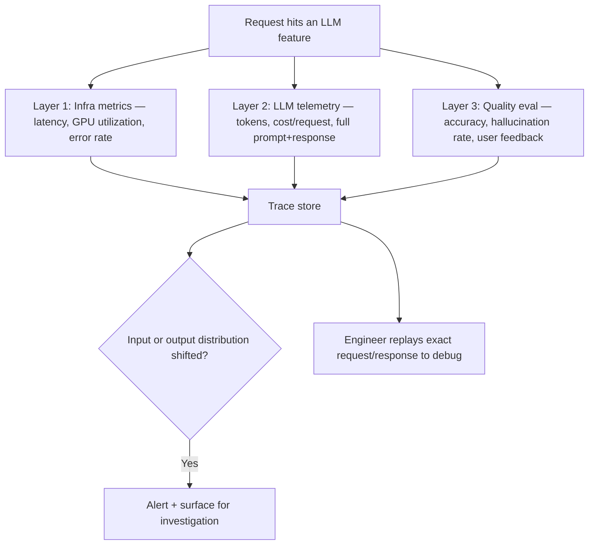

# Design an AI Observability & Monitoring Platform

*AI Production Systems · Focus: AI/LLM infrastructure, observability · ~75 min*

## The actual problem

Traditional service observability (latency, error rate, CPU) tells you the service is *running*. It tells you nothing about whether the LLM feature running on top of it is producing *good* output. A feature can look perfectly healthy on every infrastructure dashboard while quietly generating wrong answers to every user — and this is, per 2026 interview guidance, the single most commonly skipped part of AI system design. An agent that works in a demo but can't be traced or rolled back doesn't pass a production bar, however well it demoed.

## How it actually works

The three layers are genuinely separate, not one dashboard with extra metrics bolted on. Infrastructure metrics tell you the system is up. LLM telemetry — token counts, cost per request, and the actual prompt and response text, not merely that a call occurred — tells you what the model was asked and what it said back. Quality evaluation tells you whether any of that was actually good: correct, non-hallucinated, well-received by the user who saw it. This isn't just a taxonomy exercise — it's now close to a documented standard. OpenTelemetry's GenAI semantic conventions define a shared set of attributes for exactly this (token usage, cost, agent and tool steps), and it's already implemented across AWS, GCP, Azure, and Datadog ([OpenTelemetry, 2026](https://opentelemetry.io/blog/2026/genai-observability/)) — which means "we rolled our own schema for this" is a weaker answer than it used to be.

Full traceability underpins everything above it. Without the ability to reconstruct exactly what a specific request or agent run did — every retrieved chunk, every tool call, every intermediate step — a bad output a real user hit is something you can only guess about, not debug. That gets worse, not better, in multi-agent or multi-step systems, where the actual failure could be hiding in any one of several steps.

Drift is a two-sided problem and most designs only watch one side of it. Input drift is what users are asking shifting over time — new topics, new phrasing nobody designed for. Output drift is the model's own behavior changing, which is a sharper risk when the model is a third-party API a provider can update out from under you with no warning.

And "rollback" doesn't mean the same thing for every kind of change here. Reverting a prompt template or swapping back to a previous model version is cheap and fast. Reverting a fine-tune, or an embedding-model change that implies re-embedding an entire corpus, is neither. A design that's explicit about which changes are cheap to undo — and ships the expensive ones more cautiously as a result — is answering a question most candidates don't think to ask.

## The practice prompt

Design a monitoring platform for a company running multiple LLM-based features in production. Cover what gets measured, how quality regressions get caught, and how an engineer would actually debug a bad output from a real user.

## Rubric

See [the shared rubric](../rubric.md).

## Likely follow-up

Design first, then reveal

A single bad prompt-template change caused a silent quality regression that took two weeks to notice. What's missing from your design that would have caught it in two hours?

