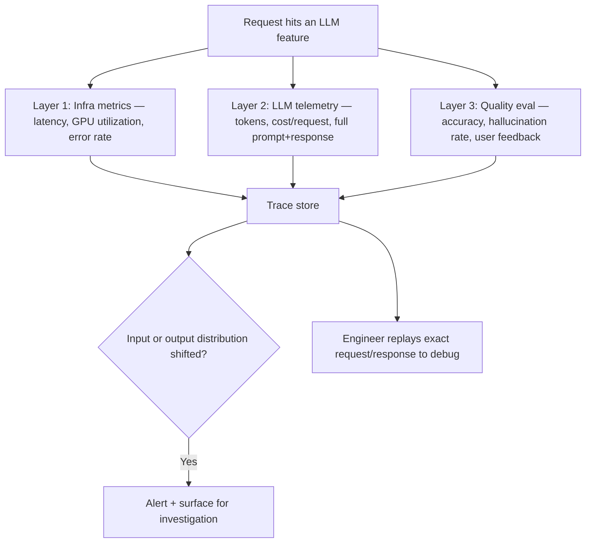

# Design an AI Observability & Monitoring Platform

*AI Production Systems · Focus: AI/LLM infrastructure, observability · ~75 min*

## The actual problem

Traditional service observability (latency, error rate, CPU) tells you the service is *running*. It tells you nothing about whether the LLM feature running on top of it is producing *good* output. A feature can look perfectly healthy on every infrastructure dashboard while quietly generating wrong answers to every user — and this is, per 2026 interview guidance, the single most commonly skipped part of AI system design. An agent that works in a demo but can't be traced or rolled back doesn't pass a production bar, however well it demoed.

## How it actually works

**These are three genuinely separate layers, not one dashboard with more metrics on it.** Infrastructure metrics tell you the system is up. LLM telemetry — token counts, cost per request, and critically, the actual prompt and response text, not just that a call happened — tells you what the model was actually asked and what it actually said. Quality evaluation — is the output correct, is it hallucinating, what do users think of it — tells you whether any of that mattered. Each layer needs different tooling and different people looking at it; conflating them into "we have logging" misses the point.

**Full traceability is the foundation everything else depends on, not a nice-to-have.** If you can't reconstruct exactly what a specific request or agent run actually did — every retrieved chunk, every tool call, every intermediate reasoning step — you cannot debug a bad output a real user hit. You can only guess. This matters even more for multi-agent or multi-step systems, where the failure could be in any of several steps.

**Drift shows up on two different sides, and both matter.** Input drift is the distribution of what users are actually asking changing over time — new topics, new phrasing, new intents nobody designed for. Output drift is the model's own behavior shifting — which is a real risk specifically when the model is a third-party API you don't control, since the provider can update it under you without warning. A monitoring design that only watches one side is watching half the problem.

**"Rollback" means something different here than for normal software.** Rolling back a prompt template or a model version is usually fast and cheap. Rolling back a fine-tune or an embedding-model change (which requires re-embedding a whole corpus) can be slow and expensive. A strong design is explicit about which parts of the system are cheap to roll back and which aren't, because that difference should drive how cautiously each type of change gets shipped.

## The practice prompt

Design a monitoring platform for a company running multiple LLM-based features in production. Cover what gets measured, how quality regressions get caught, and how an engineer would actually debug a bad output from a real user.

## Rubric

See [the shared rubric](../rubric.md).

## Likely follow-up

Design first, then reveal

A single bad prompt-template change caused a silent quality regression that took two weeks to notice. What's missing from your design that would have caught it in two hours?

