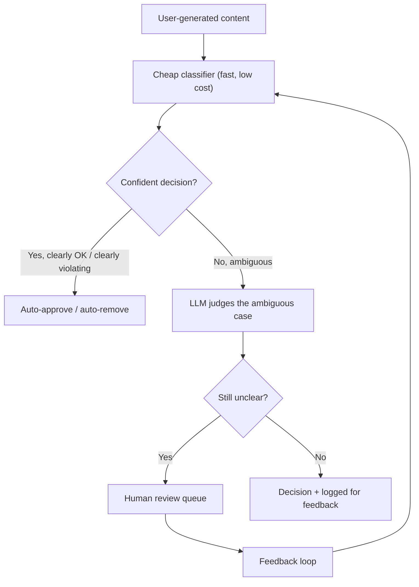

# Design a Content Moderation Pipeline Using an LLM

*AI Production Systems · Focus: AI/LLM infrastructure, cost & operational reasoning · ~75 min*

## The actual problem

An LLM can moderate content more flexibly than a rule-based classifier — it can reason about context and intent, not just match patterns. But calling an LLM on every single piece of user-generated content, at platform scale, is a real and often dominant cost line, so the design question isn't "can an LLM do this well," it's "how do you get LLM-quality judgment without LLM-scale cost."

## How it actually works

**The tiered structure is the entire cost strategy.** A cheap classifier (a small fine-tuned model, or even simple heuristics) handles the large majority of clearly-fine or clearly-violating content in milliseconds at near-zero marginal cost. Only the genuinely ambiguous fraction — which is normally a small percentage of total volume — goes to the LLM. Running every piece of content through the LLM "for quality" is usually a cost decision dressed up as a quality argument; the cheap tier isn't a compromise, it's the majority of the system's actual value.

**Latency budget determines what can be synchronous.** Content that needs to appear the instant it's posted (a comment, a chat message) has a tight latency budget that effectively rules out anything beyond the cheap tier at request time — ambiguous cases get posted provisionally and reviewed asynchronously, with removal happening after the fact if needed. Content that isn't time-sensitive (a long-form post under review before wider distribution) can afford the LLM or human-review path before it ever goes live.

**The human review path isn't just a safety net — it's the training signal.** Every human decision on an ambiguous case is a labeled example that can improve the cheap tier's classifier over time, gradually shrinking the fraction of content that needs the expensive path at all. A design that treats human review as pure cost, with no feedback loop back into the cheap tier, is leaving the main long-term cost lever unused.

**Cost spikes need two different responses on two different timescales.** A sudden volume spike (a viral moment) needs an immediate, cheap mitigation — tightening the cheap tier's confidence threshold so fewer borderline cases escalate to the LLM, accepting slightly more false positives/negatives temporarily. The actual fix — retraining or fine-tuning the cheap classifier on the new volume's patterns — happens on a much longer timescale. Conflating "what do we do right now" with "what's the real fix" is a common weak spot in this design.

## The practice prompt

Design a pipeline that moderates user-generated content (text and images) at scale, using a mix of cheap classifiers and an LLM for ambiguous cases. Cover the cost trade-off between running everything through the LLM versus a tiered approach, latency budget for real-time posting, and human review for edge cases.

## Rubric

See [the shared rubric](../rubric.md).

## Likely follow-up

Design first, then reveal

Volume just tripled overnight after a viral moment, and your LLM moderation costs tripled with it. What do you change in the next hour, versus what you'd change over the next month?

