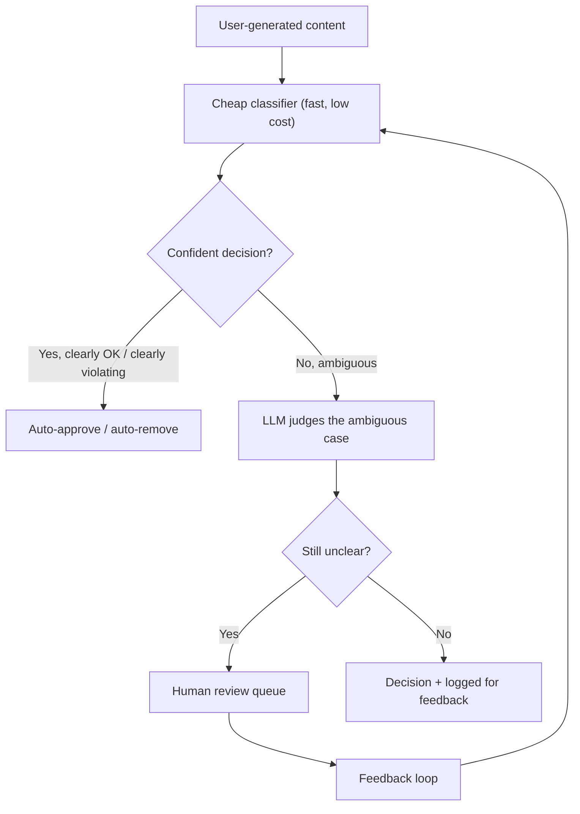

# Design a Content Moderation Pipeline Using an LLM

*AI Production Systems · Focus: AI/LLM infrastructure, cost & operational reasoning · ~75 min*

## The actual problem

An LLM can moderate content more flexibly than a rule-based classifier — it can reason about context and intent, not just match patterns. But calling an LLM on every single piece of user-generated content, at platform scale, is a real and often dominant cost line, so the design question isn't "can an LLM do this well," it's "how do you get LLM-quality judgment without LLM-scale cost."

## How it actually works

The tiered structure carries almost the entire cost strategy on its own. A cheap classifier — a small fine-tuned model, or in some cases just heuristics — handles the large majority of clearly-fine or clearly-violating content in milliseconds, at close to zero marginal cost. Only the genuinely ambiguous slice, which is normally a small percentage of total volume, ever reaches the LLM. Routing everything through the LLM "for consistency" is usually a cost decision wearing a quality argument as a disguise; the cheap tier isn't the compromise here, it's most of the system's actual value.

Latency budget decides what can even be synchronous. A comment or chat message that needs to appear the instant it's posted has a tight enough budget to rule out anything past the cheap tier at request time — so ambiguous cases get posted provisionally and reviewed asynchronously, with takedown after the fact if needed. Content that isn't time-sensitive, like a long-form post pending wider distribution, can afford the LLM or a human review pass before it ever goes live.

Human review does double duty, and treating it as pure cost misses half its value. Every human decision on an ambiguous case is a labeled example that can train the cheap tier's classifier, gradually shrinking how much content needs the expensive path in the first place. Skip the feedback loop back into the cheap tier, and the main long-term lever for reducing cost just sits unused.

A sudden cost spike and the actual fix for it live on different timescales, and mixing them up is a common weak spot. The immediate response to a viral-moment volume spike is cheap and blunt — tighten the cheap tier's confidence threshold so fewer borderline cases escalate, accept a few more false positives or negatives for now. The real fix — retraining the cheap classifier on the new traffic pattern — happens over weeks, not the next hour. Answering "what do we do right now" with the second one is a tell.

## The practice prompt

Design a pipeline that moderates user-generated content (text and images) at scale, using a mix of cheap classifiers and an LLM for ambiguous cases. Cover the cost trade-off between running everything through the LLM versus a tiered approach, latency budget for real-time posting, and human review for edge cases.

## Rubric

See [the shared rubric](../rubric.md).

## Likely follow-up

Design first, then reveal

Volume just tripled overnight after a viral moment, and your LLM moderation costs tripled with it. What do you change in the next hour, versus what you'd change over the next month?

