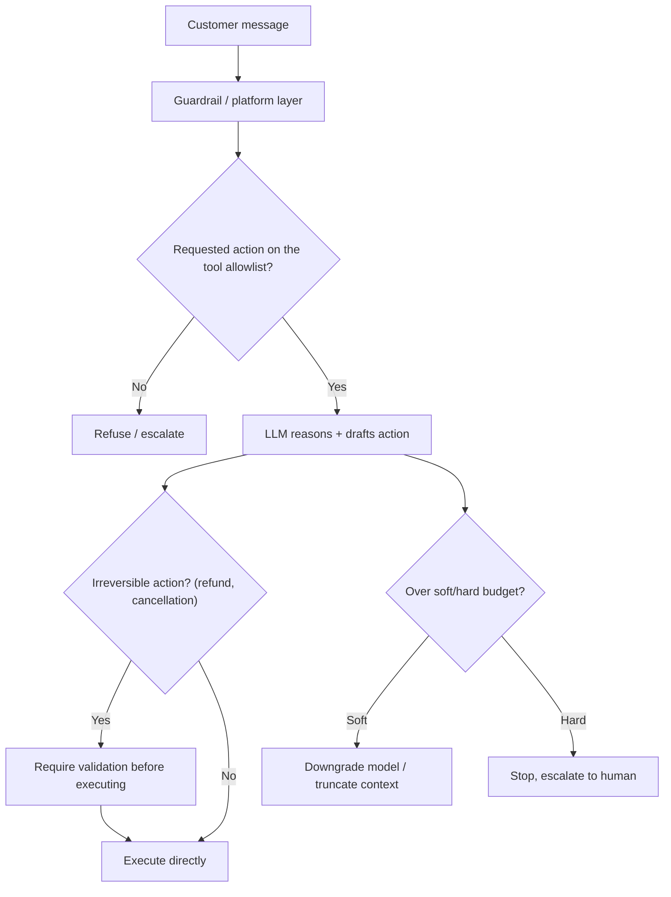

# Design a Customer-Support Chatbot on a Third-Party LLM

*AI Production Systems · Focus: AI/LLM infrastructure, reliability · ~75 min*

## The actual problem

A support chatbot needs access to real customer data (order history, account state) and real capabilities (issuing refunds, updating an order) to actually be useful — which means it isn't just a Q&A system anymore, it's an agent that can take consequential, sometimes irreversible actions on a company's behalf, built on a model you don't control the internals of.

The design problem isn't "how does it answer questions" — it's "how do you bound what it's allowed to do, and catch it when it's wrong."

## How it actually works

Worth separating up front: safety and security are not the same failure mode. Safety covers the system's own unintended behavior — hallucinating a policy that doesn't exist, taking an action it shouldn't, running up cost through unnecessary back-and-forth. Security covers someone deliberately attacking it — a crafted prompt injection meant to override its instructions, an attempt to extract another customer's data. A design that only addresses one leaves the other completely open, and it's a common enough gap that naming both explicitly is worth doing early.

Anthropic's agent-building guidance is relevant here too: don't have the same model that's handling the conversation also be the thing deciding whether its own output is safe to send. A second, dedicated model instance screening inputs and outputs tends to hold up better than one model doing both jobs ([Anthropic Engineering](https://www.anthropic.com/engineering/building-effective-agents)) — and that screening layer is naturally where guardrails belong: centralized at the gateway every request already passes through, rather than reimplemented ad hoc inside each team's service.

Tool allowlisting is a mechanism, not a policy document. The bot should be structurally incapable of calling anything outside an explicit, narrow set of permitted actions. "Look up order status" and "issue a refund under $50 with manager auto-approval" are different tools with genuinely different risk profiles — collapsing them into one generic "take action" capability throws away the distinction that actually matters.

Hard limits and soft limits solve different problems, and conflating them tends to mean overreacting to minor issues while under-reacting to serious ones. A hard limit stops the interaction outright once a real threshold is crossed — a cost ceiling, a flagged suspicious action. A soft limit degrades gracefully instead: downgrade to a cheaper model, truncate context, narrow what the bot's allowed to attempt, without ending the conversation.

The step where the model decides to issue a refund and the step where the refund actually happens should never be the same step. A validation layer — rule-based for clear cases, human-in-the-loop for high-stakes or ambiguous ones — belongs between the two, for any action that can't be undone.

And the escalation trigger needs to be something you could actually implement, not a vibe. Repeated failed attempts, a flagged high-risk action, a detected frustration signal, or simply hitting a turn-count ceiling are all real triggers. "Escalate when the bot seems stuck" is not one.

## The practice prompt

Design a customer-support chatbot built on top of a third-party LLM platform, with access to order history and support docs. Cover context-window management across a long conversation, escalation to a human agent, and guardrails against the bot making commitments it shouldn't (refunds, promises).

## Rubric

See [the shared rubric](../rubric.md).

## Likely follow-up

Design first, then reveal

The bot just told a customer it would issue a refund it has no authority to approve. How does your design prevent that from happening again, not just this once?

