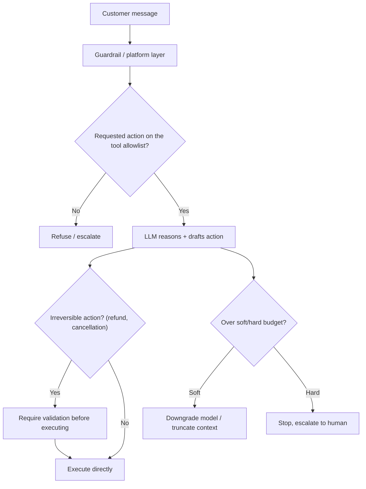

# Design a Customer-Support Chatbot on a Third-Party LLM

*AI Production Systems · Focus: AI/LLM infrastructure, reliability · ~75 min*

## The actual problem

A support chatbot needs access to real customer data (order history, account state) and real capabilities (issuing refunds, updating an order) to actually be useful — which means it isn't just a Q&A system anymore, it's an agent that can take consequential, sometimes irreversible actions on a company's behalf, built on a model you don't control the internals of.

The design problem isn't "how does it answer questions" — it's "how do you bound what it's allowed to do, and catch it when it's wrong."

## How it actually works

**Safety and security are two different problems, and a strong answer names both.** Safety is about the system's own unintended behavior — hallucinating a policy that doesn't exist, taking an action it shouldn't, running up cost through excessive back-and-forth. Security is about adversarial behavior directed at the system — a user crafting a prompt injection to make the bot ignore its instructions, or trying to extract another customer's data. Guardrails that only address one of these leave the other wide open.

**Guardrails belong at the gateway/platform layer, not scattered across individual service code.** If every team that builds an LLM feature implements its own ad hoc safety checks, you get inconsistent enforcement and no single place to audit what happened. Centralizing guardrails at the layer every request already passes through gives you one enforcement point and one audit trail.

**Tool allowlisting is the actual mechanism, not a policy statement.** The bot should be structurally unable to call anything beyond an explicit, narrow set of permitted actions — "look up order status" and "issue a refund under $50 with manager auto-approval" are different tools with different risk profiles, not one generic "take action" capability.

**Hard limits and soft limits are different controls for different situations.** A hard limit stops the agent completely once a threshold is crossed (a cost ceiling, a suspicious action) and returns a fallback response. A soft limit degrades gracefully — switch to a cheaper model, truncate the context window, reduce what the bot is allowed to attempt — without fully stopping the interaction. Conflating the two means you either overreact to minor issues or fail to react to serious ones.

**Output validation before irreversible actions is a distinct step from generating the response.** The model deciding to issue a refund and the system actually issuing it should not be the same step — a validation layer (rule-based or human-in-the-loop, depending on the amount and risk) sits between "the model decided to do X" and "X actually happened."

**The escalation path needs an explicit trigger, not a vague "when needed."** Repeated failed attempts, a detected high-risk action, explicit customer frustration signals, or simply exceeding a turn count are all concrete, implementable triggers; "escalate when the bot is stuck" is not.

## The practice prompt

Design a customer-support chatbot built on top of a third-party LLM platform, with access to order history and support docs. Cover context-window management across a long conversation, escalation to a human agent, and guardrails against the bot making commitments it shouldn't (refunds, promises).

## Rubric

See [the shared rubric](../rubric.md).

## Likely follow-up

Design first, then reveal

The bot just told a customer it would issue a refund it has no authority to approve. How does your design prevent that from happening again, not just this once?

