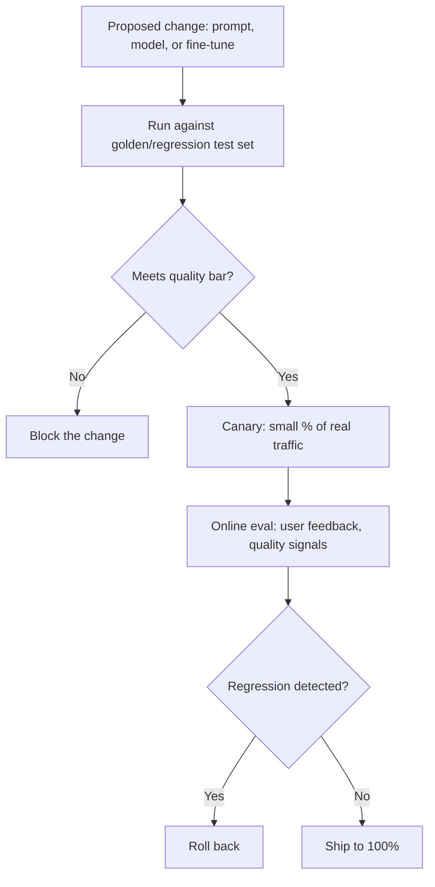

# Design an LLM Evaluation Pipeline

*AI Production Systems · Focus: AI/LLM infrastructure, observability · ~75 min*

## The actual problem

Traditional software has deterministic tests: same input, same expected output, pass or fail. An LLM-based feature doesn't work that way — the same prompt can produce different phrasing on different runs, and "correct" is often fuzzier than a string match. Without a real evaluation pipeline, the only way a regression gets caught is a user complaining, which is both slow and a bad way to find out.

## How it actually works

A golden/regression test set is the baseline everything else builds on. Every proposed change — a new prompt, a different model, a fine-tune — runs against the same fixed set of representative inputs with known-good expected qualities before it ships to anyone. "One engineer spot-checked it before merging" is not a substitute; a golden set is what makes a change actually reviewable instead of a judgment call by whoever happened to write it. OpenAI's own guidance for their evals framework puts this plainly: evaluation should be run on every change, treated as infrastructure rather than a final check before launch ([OpenAI, evaluation best practices](https://developers.openai.com/api/docs/guides/evaluation-best-practices); [openai/evals](https://github.com/openai/evals)).

Offline and online evaluation aren't redundant with each other — they catch different failure classes. Offline evaluation, against the golden set, is fast, cheap, and repeatable, but it can only test what someone thought to write a test for. Online evaluation — a canary release against real traffic, watching real user feedback signals — catches exactly the failure modes nobody anticipated, at the cost of some real users seeing the regression first. Pick one and you've picked one gap over the other.

Who or what actually judges quality is worth being deliberate about, because each option fails differently. Human review handles nuance well but doesn't scale and is slow. An LLM-as-judge — a second model scoring the first one's output — scales far better and, per current practice, correlates surprisingly well with human judgment when it's properly calibrated; it also inherits its own blind spots and can be gamed by output that merely looks right. Hard-coded checks (required fields present, no banned content) are fast and reliable for exactly what they check and nothing else. Most mature pipelines run more than one of these in layers rather than committing to a single judge.

The genuinely hard cases are the fuzzy ones: technically correct but unhelpful, or right answer delivered in the wrong tone. A pipeline that only checks factual correctness will happily pass a response that's accurate and useless, and have no idea it has a problem — which is usually where human review or targeted user feedback ends up doing the work automated checks structurally can't.

## The practice prompt

Design the evaluation pipeline a team uses before shipping any change to a prompt, model, or fine-tune — so a regression gets caught before it reaches users, not after.

## Rubric

See [the shared rubric](../rubric.md).

## Likely follow-up

Design first, then reveal

A prompt change passed every golden-set test but caused a real quality drop for a class of query nobody had written a test for. How would you have caught that class of failure?

