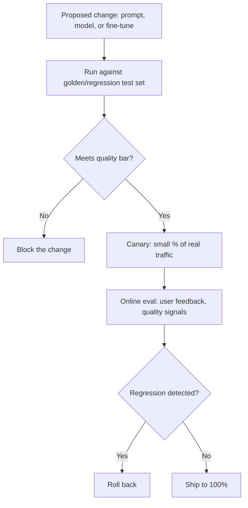

# Design an LLM Evaluation Pipeline

*AI Production Systems · Focus: AI/LLM infrastructure, observability · ~75 min*

## The actual problem

Traditional software has deterministic tests: same input, same expected output, pass or fail. An LLM-based feature doesn't work that way — the same prompt can produce different phrasing on different runs, and "correct" is often fuzzier than a string match. Without a real evaluation pipeline, the only way a regression gets caught is a user complaining, which is both slow and a bad way to find out.

## How it actually works

**A golden/regression test set is the non-negotiable baseline, and "ad hoc spot checks by whoever made the change" is not a substitute for one.** Every proposed change — a new prompt, a different model, a fine-tune — runs against the same fixed set of representative inputs with known-good expected qualities, before it ships to anyone. This is what actually makes a change reviewable rather than a judgment call by one person.

**Offline and online evaluation catch genuinely different failure classes, and you need both.** Offline evaluation (against the golden set) is fast, cheap, and repeatable, but it can only test what someone thought to include — it has no way to catch a failure mode nobody anticipated. Online evaluation (a canary release against real traffic, with real user feedback signals) catches exactly those unanticipated failure modes, at the cost of some real users seeing the regression before it's caught. Relying on only one of these leaves a real gap.

**Who or what actually judges quality is a real design decision with real trade-offs.** Human review is the most reliable for nuanced judgment but doesn't scale and is slow. A separate "judge" model (a second LLM call scoring the first one's output) scales well but inherits its own blind spots and can be gamed by outputs that look right without being right. Hard-coded checks (does the output contain required fields, does it avoid banned content) are fast and reliable for what they check, but can't catch anything outside their narrow scope. A mature pipeline usually layers more than one of these rather than picking exactly one.

**The hardest cases to evaluate are the fuzzy ones — "technically correct but unhelpful," or "right answer, wrong tone."** A pipeline that only checks factual correctness will pass a technically-accurate response that's actually useless to the user, and never know it has a problem. This is usually where human review or targeted user-feedback signals have to fill in what automated checks structurally can't judge.

## The practice prompt

Design the evaluation pipeline a team uses before shipping any change to a prompt, model, or fine-tune — so a regression gets caught before it reaches users, not after.

## Rubric

See [the shared rubric](../rubric.md).

## Likely follow-up

Design first, then reveal

A prompt change passed every golden-set test but caused a real quality drop for a class of query nobody had written a test for. How would you have caught that class of failure?

