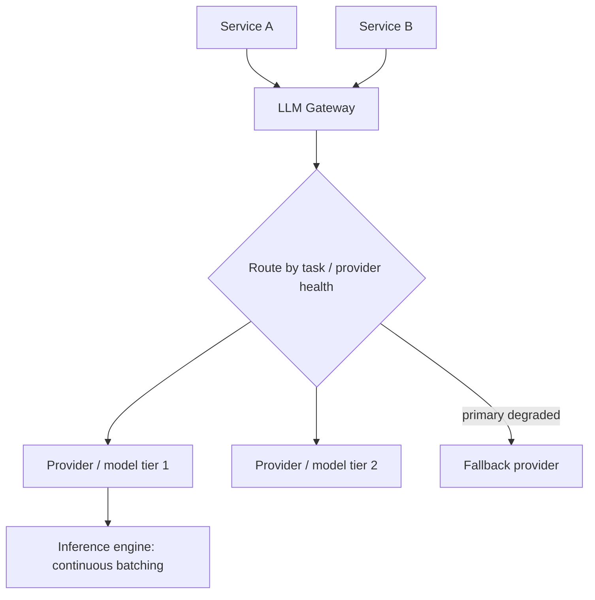

# Design an LLM Serving Gateway

*AI Production Systems · Focus: AI/LLM infrastructure, scalability · ~75 min*

## The actual problem

Every backend service in your product that needs an LLM call could talk to a provider directly — but then routing, retries, rate limits, and cost tracking all get reimplemented per service, inconsistently. A serving gateway centralizes that: one layer between your services and one or more LLM providers/self-hosted models, handling routing, batching, streaming, and failure behavior in one place.

If you're self-hosting the model rather than calling a third-party API, the gateway also sits directly on top of the actual inference engine — and that's where most of the non-obvious engineering lives.

## How it actually works

**Continuous batching is the single biggest lever, and it's not intuitive.** Naive ("static") batching waits for a full batch of requests before running inference, then waits for the whole batch to finish before starting the next one — so a fast request sits blocked behind a slow one. Continuous (iteration-level) batching lets new requests join the running batch as soon as a GPU execution step finishes, and lets finished requests leave immediately, without waiting for the whole batch. In production this typically delivers 4-8x more throughput on the same hardware — it's an architectural choice in the serving loop, not a tuning parameter.

**Disaggregated prefill/decode is the next layer of this.** Processing the input prompt (prefill) is compute-heavy and highly parallelizable; generating each output token (decode) is memory-bandwidth-heavy and sequential. Running both phases on the same GPU pool means they compete for the same resource in different ways. Separating them — different hardware or scheduling policy for each — lets you tune each phase independently instead of compromising on both.

**VRAM, not compute, is usually the actual constraint.** A model's memory footprint is roughly: `parameters × bytes-per-parameter (quantization level) + KV cache size + 2-4GB runtime overhead`. The KV cache — the per-request memory holding attention state for every token generated so far — grows with both sequence length and concurrent requests, and is often the thing that actually caps how many requests you can serve at once, not FLOPs.

**Quantization is the direct cost lever on that constraint.** Moving from FP16 to FP8 roughly halves memory with minimal quality loss for most workloads; INT4 (via AWQ/GPTQ-style quantization) roughly quarters it, at higher risk of quality degradation that needs to be actually measured, not assumed away.

**Multi-provider routing exists for two different reasons**: cost/quality routing (send easy tasks to a cheap model, hard ones to a frontier model) and reliability (fail over to a different provider when the primary is down or degraded). These are different problems that happen to share the same "router" component.

**Utilization is a real operational signal.** GPU utilization sitting below roughly 60% at peak load usually means the batching configuration is wrong or the fleet is over-provisioned — "buy more GPUs" is often the wrong fix for what's actually a batching problem.

## The practice prompt

Design a gateway that sits between your product's backend services and one or more LLM providers. Cover request routing across providers/models, timeout and retry behavior, streaming responses, and rate limit handling per provider.

## Rubric

See [the shared rubric](../rubric.md).

## Likely follow-up

Design first, then reveal

Your primary LLM provider has a regional outage during peak traffic. What's your fallback path, and what does the user actually experience?

