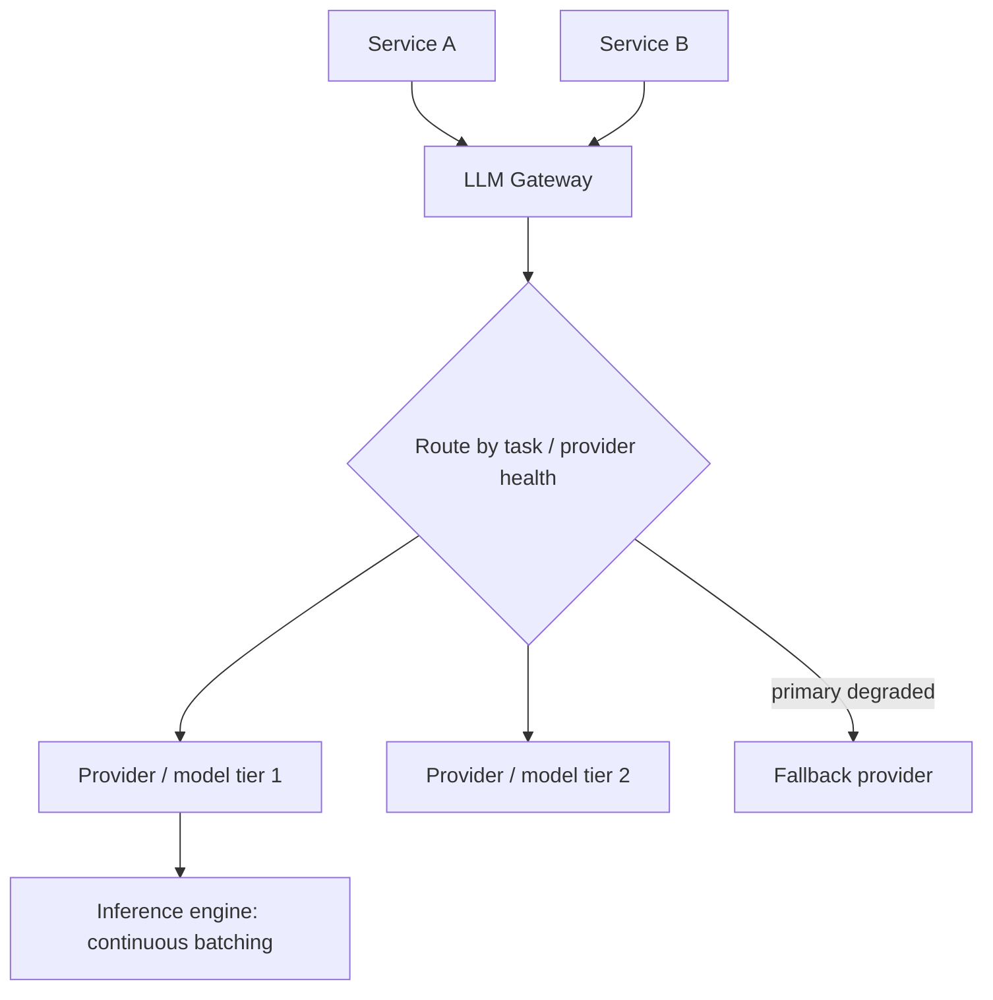

# Design an LLM Serving Gateway

*AI Production Systems · Focus: AI/LLM infrastructure, scalability · ~75 min*

## The actual problem

Every backend service in your product that needs an LLM call could talk to a provider directly — but then routing, retries, rate limits, and cost tracking all get reimplemented per service, inconsistently. A serving gateway centralizes that: one layer between your services and one or more LLM providers/self-hosted models, handling routing, batching, streaming, and failure behavior in one place.

If you're self-hosting the model rather than calling a third-party API, the gateway also sits directly on top of the actual inference engine — and that's where most of the non-obvious engineering lives.

## How it actually works

Start with batching, because it's the single biggest lever and the least intuitive. Static batching waits for a full batch to form, runs it, and waits for every request in that batch to finish before starting the next one — so a fast request sits blocked behind a slow one for no good reason. The fix is iteration-level scheduling: let a new request join the running batch the moment a GPU step finishes, and let a finished one leave immediately without waiting on its neighbors. This isn't a minor optimization — the paper that introduced it measured a 36.9x throughput gain over FasterTransformer at matched latency ([Yu et al., OSDI 2022](https://www.usenix.org/system/files/osdi22-yu.pdf)). vLLM's PagedAttention then went after the memory side of the same problem — the KV cache (the per-request memory holding attention state for every generated token) fragments badly under naive allocation, and paging it the way an OS pages virtual memory recovered another 2-4x ([Kwon et al., SOSP 2023](https://arxiv.org/abs/2309.06180)).

Once batching is solid, the next question is whether prefill and decode should even share a GPU pool. Prefill — processing the input prompt — is compute-bound and parallelizes well. Decode — generating each output token, one at a time — is memory-bandwidth-bound and inherently sequential. Put them on the same hardware and they compete for the same resource in opposite ways. DistServe's answer was to just not share: run them on separate GPU pools, ship the KV cache over when a request transitions from one phase to the other ([Zhong et al., 2024](https://arxiv.org/abs/2401.09670)).

Here's the part interviewers actually probe on: what's the real constraint, memory or compute? It's usually memory. A model's footprint is roughly `parameters × bytes-per-parameter (set by quantization) + KV cache + a couple GB of runtime overhead`, and the KV cache term grows with both sequence length and how many requests you're serving concurrently — that's frequently what caps throughput, not FLOPs. Quantization is the direct lever on that number: FP8 roughly halves memory for most workloads with little quality loss, INT4 roughly quarters it but needs its quality impact actually measured, not assumed.

Multi-provider routing gets asked about too, and it's worth separating why you're doing it. Cost/quality routing sends easy tasks to a cheap model and hard ones to a frontier model. Reliability routing fails over to a different provider when the primary is degraded or down. Same router component, two different jobs — conflating them tends to produce a design that's mediocre at both.

One more thing worth having ready: GPU utilization sitting below roughly 60% at peak isn't usually a "we need more GPUs" problem. It's usually a batching configuration problem, and saying so out loud is a good signal.

## The practice prompt

Design a gateway that sits between your product's backend services and one or more LLM providers. Cover request routing across providers/models, timeout and retry behavior, streaming responses, and rate limit handling per provider.

## Rubric

See [the shared rubric](../rubric.md).

## Likely follow-up

Design first, then reveal

Your primary LLM provider has a regional outage during peak traffic. What's your fallback path, and what does the user actually experience?

