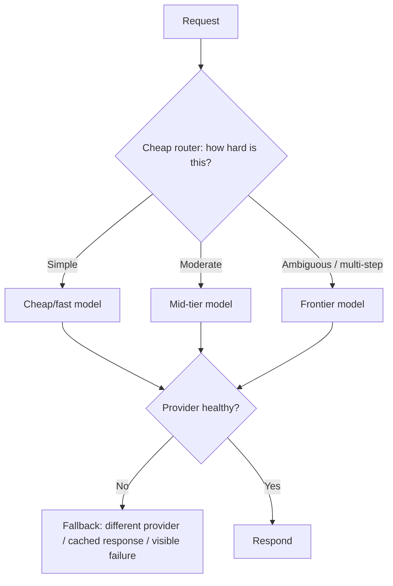

# Design a Multi-Model Routing & Fallback System

*AI Production Systems · Focus: AI/LLM infrastructure, cost & operational reasoning · ~75 min*

## The actual problem

Not every request needs your best, most expensive model — classifying a support ticket's category and drafting a nuanced multi-step plan are not the same difficulty of task, but it's easy to default everything to the frontier model out of habit or caution. Routing sends each request to an appropriately-sized model; fallback keeps the system working when a specific provider or model becomes unavailable or degraded. They're related but distinct problems that tend to live in the same component.

## How it actually works

**The router itself has to be cheap, or the whole design is self-defeating.** Using a frontier model to decide which model should handle a request costs more than just sending everything to a mid-tier model directly. A real router is a lightweight classifier — a small model, an embedding-plus-classifier, or even a simple rules/heuristics layer — that runs in milliseconds, not a full LLM call.

**Routing and cascading are two different strategies with different cost/latency shapes.** Routing decides up front, before any expensive call, which tier should handle the request — one call, correctly sized. Cascading tries the cheapest tier first and escalates only if the result doesn't meet a quality bar — which can mean two calls (cheap, then expensive) for the hardest requests, trading some latency and redundant cost for not needing a separate, accurate up-front classifier. Neither is strictly better; the right choice depends on whether you can classify difficulty reliably ahead of time.

**Fallback on a provider outage isn't one universal behavior — it depends on the feature.** Routing to a different provider preserves functionality but changes cost and possibly output style. Serving a cached or default response preserves speed and cost but loses freshness/personalization. Failing visibly preserves trust (the user knows something's wrong instead of getting a silently degraded answer) at the cost of availability. A design that picks one fallback strategy for every feature is usually wrong for at least one of them.

**The same request can behave meaningfully differently across models, so routing isn't "free" even for nominally identical tasks.** Two different models can produce different tone, different levels of verbosity, or different failure patterns on the same prompt. A routing system that treats models as interchangeable compute — same prompt in, equivalent answer out — will eventually produce a visibly inconsistent user experience depending on which tier happened to handle a given request.

**Detecting degradation is harder than detecting an outright outage.** A provider returning errors is easy to detect and route around. A provider that's still returning 200s but has tripled its latency, or is quietly returning lower-quality output, often isn't caught by a simple health check — this needs the same kind of quality/latency monitoring described in the [AI observability](ai-observability-platform.md) design, applied per-provider.

## The practice prompt

Design a system that routes each request to the right model across multiple providers/tiers based on task difficulty, and fails over gracefully when a provider is degraded or down.

## Rubric

See [the shared rubric](../rubric.md).

## Likely follow-up

Design first, then reveal

Your primary provider's latency triples during their own incident, but it never actually errors out. Your health checks don't catch it. What's actually broken in your design?

