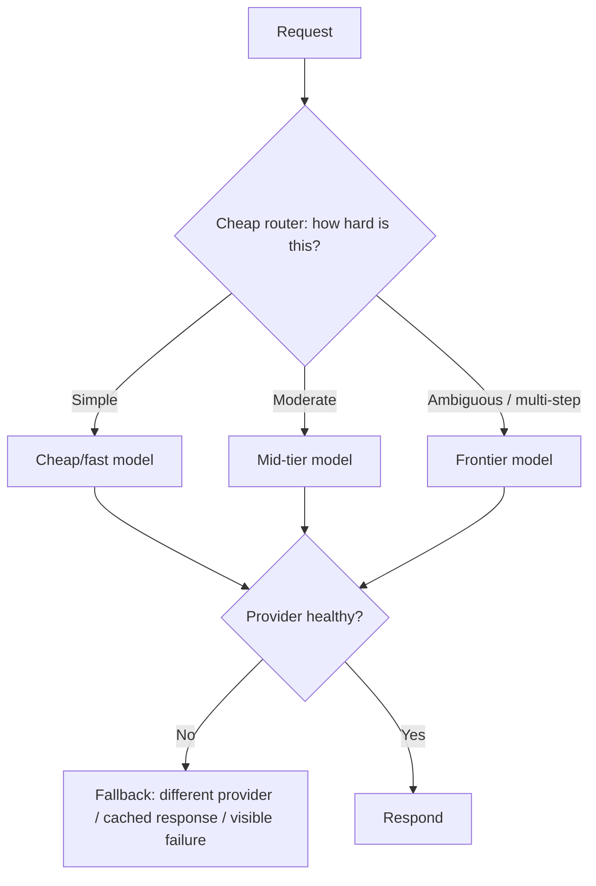

# Design a Multi-Model Routing & Fallback System

*AI Production Systems · Focus: AI/LLM infrastructure, cost & operational reasoning · ~75 min*

## The actual problem

Not every request needs your best, most expensive model — classifying a support ticket's category and drafting a nuanced multi-step plan are not the same difficulty of task, but it's easy to default everything to the frontier model out of habit or caution. Routing sends each request to an appropriately-sized model; fallback keeps the system working when a specific provider or model becomes unavailable or degraded. They're related but distinct problems that tend to live in the same component.

## How it actually works

If the router itself is expensive, the whole design defeats its own purpose — routing every request through a frontier model to decide which model should handle it costs more than just sending everything to a mid-tier model directly. A real router is a lightweight classifier: a small model, an embedding plus a simple classifier, sometimes just rules. It runs in milliseconds. It is not a full LLM call.

Routing and cascading get used interchangeably but they're different strategies with different shapes. Routing decides up front, before any expensive call happens, which tier should take the request — one call, sized correctly the first time. Cascading tries the cheapest tier first and escalates only when the result misses a quality bar, which means the hardest requests pay for two calls instead of one. Neither wins outright; it comes down to whether you can actually classify difficulty reliably before seeing the model's attempt.

What "fallback" should mean on an outage depends entirely on the feature, and picking one universal answer is usually wrong for at least one of them. Routing to a different provider keeps the feature working but changes cost and possibly tone. A cached or default response keeps things fast and cheap but sacrifices freshness. Failing visibly costs availability but keeps the user's trust intact — they know something broke instead of quietly getting a worse answer. A payments-adjacent feature and a casual chat feature should probably not make the same choice here.

Routing isn't free even when the task is nominally identical across tiers, because different models don't behave identically on the same prompt — tone, verbosity, and failure patterns all shift. Treat models as interchangeable compute and the user experience will eventually show visible seams depending on which tier happened to answer.

And degradation is genuinely harder to catch than an outright outage. A provider returning errors is easy to detect and route around. A provider still returning 200s with tripled latency, or quietly worse output, usually slips past a simple health check — which is really the [AI observability](ai-observability-platform.md) problem, applied per-provider instead of per-feature.

## The practice prompt

Design a system that routes each request to the right model across multiple providers/tiers based on task difficulty, and fails over gracefully when a provider is degraded or down.

## Rubric

See [the shared rubric](../rubric.md).

## Likely follow-up

Design first, then reveal

Your primary provider's latency triples during their own incident, but it never actually errors out. Your health checks don't catch it. What's actually broken in your design?

