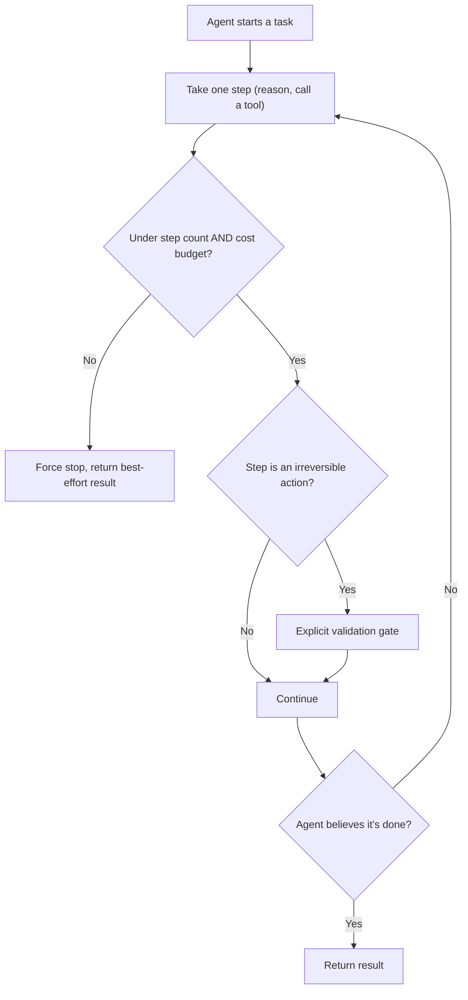

# Design a Production AI Agent Platform with Guardrails

*AI Production Systems · Focus: AI/LLM infrastructure, reliability, cost & operational reasoning · ~75 min*

## The actual problem

An agent that can only answer questions is bounded by definition — the worst case is a bad answer. An agent that can take real actions (call APIs, modify data, spend money) is not bounded by anything unless you explicitly design the bounds. The 2026 finding worth internalizing here: agents that don't know when to **stop** cause more production incidents than agents that fail outright. A clean failure is visible and cheap; a loop that keeps "succeeding" at small steps while never converging is expensive and can run for a long time before anyone notices.

## How it actually works

"The agent decides it's done" is not a termination design — it's the exact mechanism that produces a runaway loop, since a model that's convinced it's making progress has no internal reason to stop. A real design puts the stop condition outside the agent's own judgment: a step count ceiling, a cost budget, a wall-clock limit, or a detector that flags repeated identical actions, which is usually the clearest tell that something's stuck rather than working.

Anthropic's own guidance on building agents lands on a related point from a different angle: don't let the same model that's doing the work also be the thing checking whether the work is safe. Their recommendation is a second model instance dedicated to screening inputs and outputs, because a single model policing itself tends to inherit exactly the blind spots you're trying to guard against ([Anthropic Engineering](https://www.anthropic.com/engineering/building-effective-agents)). The same logic applies to termination — the check needs to sit outside the thing being checked.

Budgets need to exist at every level of the call stack, not just as one number at the top. A global cost cap doesn't stop a single sub-task inside a larger run from burning through most of it before anything else even gets a turn. Per-step, per-sub-task, and total-run limits are three different controls, and they catch three different failure shapes.

Output validation before an irreversible action — a refund, a cancellation, anything you can't take back — has to be its own step, separate from ordinary generation. A rule-based check works for well-defined cases; a human-in-the-loop check works for the ambiguous or high-stakes ones. Either way, something sits between "the agent decided to do this" and "this actually happened." The [customer-support chatbot design](customer-support-chatbot-llm.md) covers the same idea in a narrower context; here it applies to anything the agent can act on, not just support tickets.

None of this matters if it isn't tested before a real user shows up. A documented eval suite — happy path, known edge cases, and adversarial inputs someone deliberately tried to break — needs to exist *before* launch, not get written after the first incident forces the question. Pair that with a staged rollout (a small slice of traffic first, then wider) and a defined escalation path, and a gap in the guardrails shows up as a contained incident instead of a full-scale one.

## The practice prompt

Design the platform underneath an autonomous AI agent that can take real actions (not just answer questions) in production. Cover how you'd prevent it from running away, from a cost or a real-world-action standpoint.

## Rubric

See [the shared rubric](../rubric.md).

## Likely follow-up

Design first, then reveal

The agent has been looping for 40 minutes on a task that should take 2, burning budget the whole time, and nobody noticed until the bill arrived. Where exactly did your design fail to catch this?

