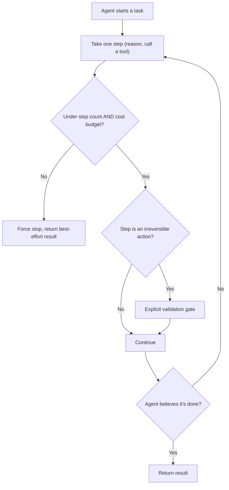

# Design a Production AI Agent Platform with Guardrails

*AI Production Systems · Focus: AI/LLM infrastructure, reliability, cost & operational reasoning · ~75 min*

## The actual problem

An agent that can only answer questions is bounded by definition — the worst case is a bad answer. An agent that can take real actions (call APIs, modify data, spend money) is not bounded by anything unless you explicitly design the bounds. The 2026 finding worth internalizing here: agents that don't know when to **stop** cause more production incidents than agents that fail outright. A clean failure is visible and cheap; a loop that keeps "succeeding" at small steps while never converging is expensive and can run for a long time before anyone notices.

## How it actually works

**Termination logic deserves the same design attention as the happy path, not an afterthought bolted on at the end.** "The agent decides it's done" is not a design — it's the exact failure mode that causes runaway loops. A real design has an explicit, structural stop condition independent of the agent's own judgment: a maximum step count, a cost ceiling, a time limit, or a detector for repeated identical actions (the clearest sign of a stuck loop).

**Budget limits need to exist at every level of the call stack, not just a global ceiling at the top.** A single top-level cost cap doesn't stop one sub-task within a larger agent run from burning most of that budget on its own before anything else even starts. Per-step, per-sub-task, and total-run budgets are three different controls that catch different failure shapes.

**Output validation before an irreversible action is a distinct step, not part of normal generation.** Whatever the agent decides to do, a separate check — rule-based for well-defined cases, human-in-the-loop for high-stakes or ambiguous ones — sits between "the agent decided to take this action" and "the action actually happened." This is the same idea as in the [customer-support chatbot design](customer-support-chatbot-llm.md), generalized to any agent that can act, not just one answering support tickets.

**A documented eval suite is a production-readiness requirement, not a nice-to-have you get to later.** Happy-path cases, known edge cases, and adversarial inputs (attempts to make the agent misbehave) all need coverage *before* the first real user interacts with the agent — not written retroactively after the first incident, when it's too late to have caught it.

**Staged rollout and a defined escalation path are what make the above enforceable in practice.** Shipping straight to 100% of traffic means any gap in the eval suite or the guardrails shows up at full scale immediately. A staged rollout (a small percentage of traffic, then wider) combined with a clear "who gets paged and when" escalation path turns a potential incident into a contained one.

## The practice prompt

Design the platform underneath an autonomous AI agent that can take real actions (not just answer questions) in production. Cover how you'd prevent it from running away, from a cost or a real-world-action standpoint.

## Rubric

See [the shared rubric](../rubric.md).

## Likely follow-up

Design first, then reveal

The agent has been looping for 40 minutes on a task that should take 2, burning budget the whole time, and nobody noticed until the bill arrived. Where exactly did your design fail to catch this?

