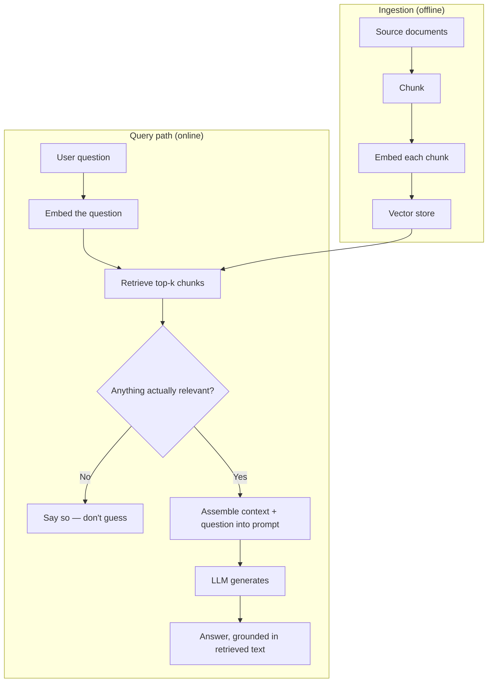

# Design a RAG-Based Q&A System

*AI Production Systems · Focus: AI/LLM infrastructure, data modeling · ~75 min*

## The actual problem

A model answers from whatever it memorized during training. It can't answer questions about your private documents, and when it doesn't actually know something, it doesn't reliably say so — it generates something fluent instead. Retrieval-augmented generation (RAG) fixes this by looking up the relevant material *before* generating, so the answer is grounded in a real source instead of the model's memory.

The interesting engineering is almost entirely in the retrieval half, not the generation half — a mediocre retrieval step makes an excellent model useless, because it never sees the right information to work with.

## How it actually works

Chunking looks like a preprocessing detail and isn't one. Fixed-size chunks (say, 500 tokens) are simple and predictable, but they'll happily cut a sentence or a table in half without knowing it. Semantic chunking — splitting at natural section or paragraph boundaries — preserves meaning better, at the cost of uneven chunk sizes that complicate how you score retrieval later. Which one's right depends entirely on how structured the source documents actually are, which is exactly the kind of thing worth asking about instead of assuming.

A chunk loses context the moment it's separated from the document it came from — a chunk that says "the deadline is next Friday" means nothing on its own. Anthropic's contextual retrieval work addresses this directly: prepend a short, chunk-specific explanation of what the chunk is from before embedding it, and retrieval failures drop by up to 67% when combined with reranking ([Anthropic Engineering](https://www.anthropic.com/engineering/contextual-retrieval)). That's a large, measured number for what sounds like a small change, which is exactly why it's worth naming specifically rather than gesturing at "good chunking."

The embedding model itself is a dependency you're stuck with, not a config value. Change it later and every chunk in the store needs to be re-embedded — a real, sometimes significant cost at scale, not a redeploy.

Vector stores need to actually survive past the demo stage. Brute-force comparison is fine at a few thousand vectors and falls over well before a few million, where approximate nearest-neighbor indexing (HNSW, IVF) becomes necessary — trading a small amount of recall for a large amount of speed. That's also the point where partitioning the index across machines stops being optional.

The most commonly missing piece: what happens when nothing relevant comes back. A system that always retrieves *something* and hands it to the model will generate a confident, wrong answer the moment the real answer simply isn't in the corpus. An explicit relevance threshold, with an explicit "I don't have information about that" path, has to be part of the design from the start — not a fallback added after the first embarrassing wrong answer.

Two things are easy to skip and both matter at scale: freshness (re-indexing only what changed, rather than re-embedding the whole corpus every time something updates) and evaluation (a retrieval-quality metric that tells you whether a change — a new embedding model, a different chunking strategy — actually helped, instead of finding out from user complaints).

## The practice prompt

Design a system that answers questions over a large private document set using retrieval-augmented generation. Cover chunking and embedding strategy, vector store choice, how retrieved context gets assembled into the prompt, and what happens when retrieval finds nothing relevant.

## Rubric

See [the shared rubric](../rubric.md).

## Likely follow-up

Design first, then reveal

Users are getting confidently wrong answers when the real answer isn't in the document set at all. How do you detect and fix that class of failure specifically?

