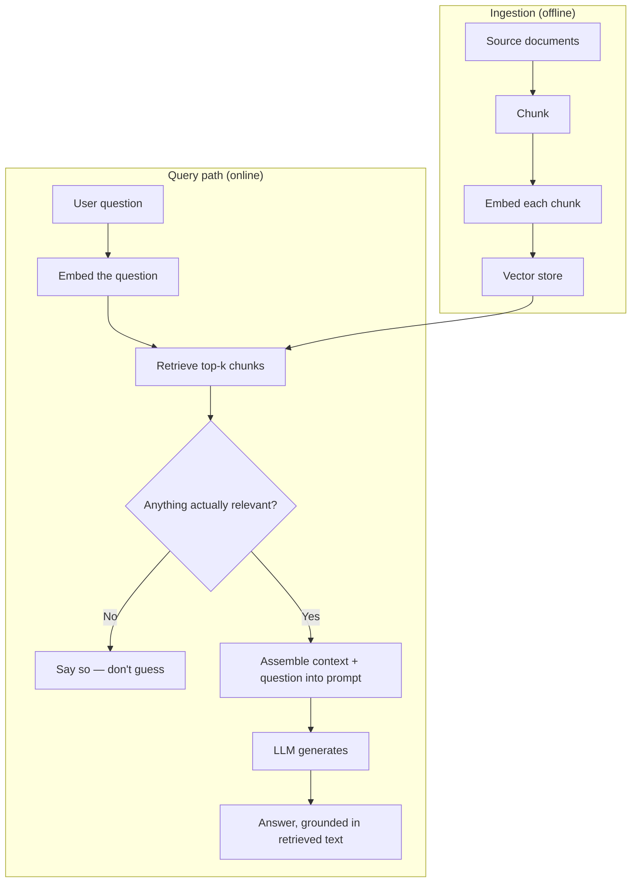

# Design a RAG-Based Q&A System

*AI Production Systems · Focus: AI/LLM infrastructure, data modeling · ~75 min*

## The actual problem

A model answers from whatever it memorized during training. It can't answer questions about your private documents, and when it doesn't actually know something, it doesn't reliably say so — it generates something fluent instead. Retrieval-augmented generation (RAG) fixes this by looking up the relevant material *before* generating, so the answer is grounded in a real source instead of the model's memory.

The interesting engineering is almost entirely in the retrieval half, not the generation half — a mediocre retrieval step makes an excellent model useless, because it never sees the right information to work with.

## How it actually works

**Chunking** is a real design decision, not a detail. Fixed-size chunks (e.g. 500 tokens) are simple and predictable but can cut a sentence or a table in half. Semantic chunking (splitting at natural section/paragraph boundaries) preserves meaning better but produces uneven chunk sizes that complicate downstream retrieval scoring. There's no universally correct choice — it depends on how structured your source documents are.

**Embeddings** turn each chunk into a vector such that semantically similar text ends up numerically close. The embedding model is a real dependency: if you switch models later, every chunk in the store needs to be re-embedded, which is a real cost at scale, not a config change.

**The vector store** has to actually scale past a demo. A few thousand vectors work fine with brute-force comparison; a few million need approximate nearest-neighbor indexing (HNSW, IVF), which trades a small amount of recall for a large amount of speed. This is also where partitioning/sharding becomes a real question once one machine can't hold the index.

**The "nothing relevant" path is not an edge case — it's core to the design.** A system that always retrieves *something* and hands it to the model will produce confident, wrong answers when the real answer simply isn't in the document set. A well-designed retriever has an explicit relevance threshold and an explicit "I don't have information about that" path, rather than always forcing a top-k result into the prompt.

**Freshness** matters if the underlying documents change. Re-embedding and re-indexing the entire corpus on every change doesn't scale; a real design incrementally re-indexes only what changed, and has a defined staleness window for anything not yet re-indexed.

**Evaluation** is the part most designs skip entirely. Without a retrieval-quality metric (did the right chunk actually get retrieved for a known question) you have no way to know a change — a new embedding model, a re-chunking strategy — made things better or worse until users complain.

## The practice prompt

Design a system that answers questions over a large private document set using retrieval-augmented generation. Cover chunking and embedding strategy, vector store choice, how retrieved context gets assembled into the prompt, and what happens when retrieval finds nothing relevant.

## Rubric

See [the shared rubric](../rubric.md).

## Likely follow-up

Design first, then reveal

Users are getting confidently wrong answers when the real answer isn't in the document set at all. How do you detect and fix that class of failure specifically?

